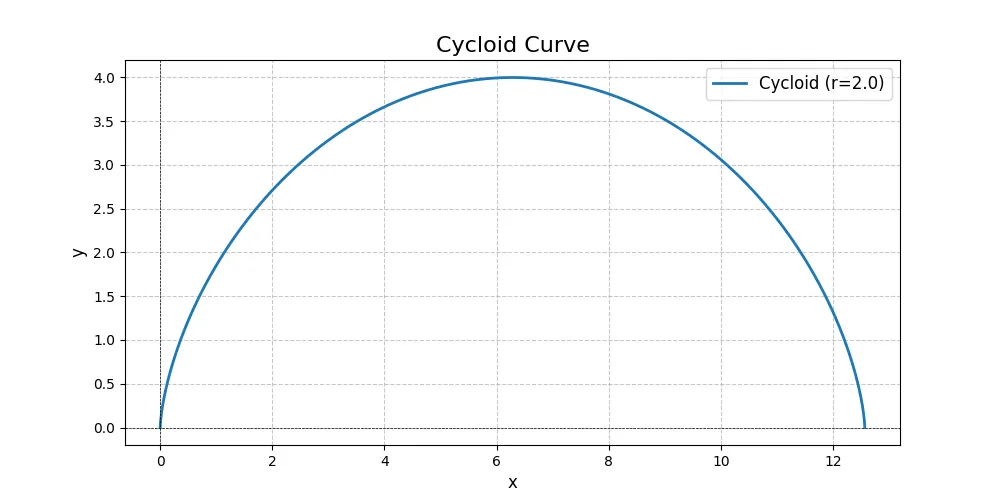
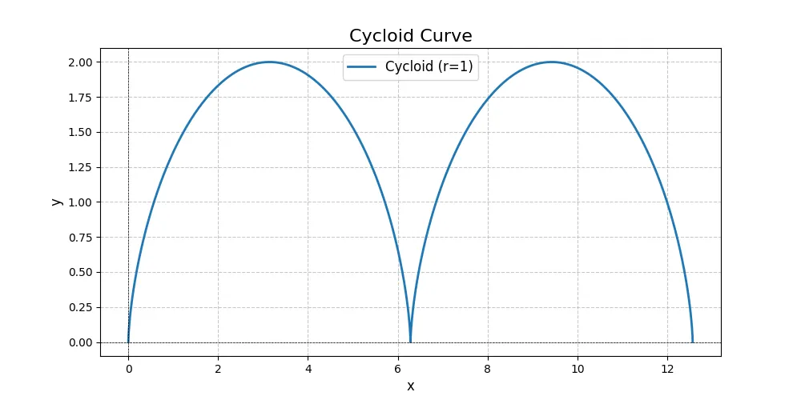

# `Cycloid Curve Generator`

> [English](README.md) , [Korean](README.ko.md)

이 프로젝트는 사이클로이드 곡선을 생성하고 시각화하기 위한 Python 기반 도구입니다. 사이클로이드는 원이 한 직선 위를 굴러갈 때, 원 위의 한 점이 그리는 궤적을 나타냅니다. 이 코드는 사용자가 다양한 파라미터를 통해 곡선을 생성하고 그래프로 시각화할 수 있도록 설계되었습니다.

## 주요 기능

- **사이클로이드 곡선 생성**: 사용자가 입력한 반지름, t 범위, 점의 개수를 기반으로 곡선을 계산합니다.
- **곡선 시각화**: 생성된 사이클로이드 곡선을 Matplotlib을 이용하여 시각화합니다.
- **유연한 파라미터 설정**: CLI를 통해 반지름, t 시작값, t 종료값, 점의 개수를 설정할 수 있습니다.

## 코드 구성

### `Cycloid` 클래스
- **생성자 (`__init__`)**
  - `radius`: 원의 반지름 (기본값: 1)
  - `t_range`: t의 시작과 종료 범위 (기본값: 0 ~ [](#) )
  - `points`: 생성할 점의 개수 (기본값: 1000)
- **`calculate_points` 메서드**
  - 사이클로이드 곡선의 x, y 좌표를 계산합니다.
- **`plot` 메서드**
  - 생성된 곡선을 그래프로 시각화합니다.

### `main` 함수
CLI 입력값을 받아 `Cycloid` 인스턴스를 생성하고 곡선을 시각화합니다.

### CLI 인터페이스
`argparse`를 이용하여 CLI 옵션을 제공합니다.
- `--radius`: 원의 반지름 (기본값: 1)
- `--t_start`: t의 시작값 (기본값: 0)
- `--t_end`: t의 종료값 (기본값: 4pi)
- `--points`: 생성할 점의 개수 (기본값: 1000)

## 사용법

### 기본 실행
```bash
python cycloid.py
```

### 파라미터 지정 실행
```bash
python cycloid.py --radius 2 --t_start 0 --t_end 2pi --points 500
```

## 요구 사항
이 프로젝트를 실행하려면 다음 Python 라이브러리가 필요합니다:
- `numpy`
- `matplotlib`

설치는 아래 명령어로 가능합니다:
```bash
pip install numpy matplotlib
```

## 결과 예시





위 코드를 통해 생성된 사이클로이드 곡선은 다양한 반지름과 범위에서 시각적으로 확인할 수 있습니다.
